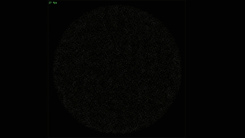

# n-body simulation



## Build

Install [Meson](https://mesonbuild.com/Quick-guide.html).

```
$ meson setup build
$ ninja -C build
$ ./build/n-body
```

## Usage

```
$ ./n-body -h
Usage: n-body
	-h Print this message
	-b Number of body (default: 1000)
	-w Number of workers (default: 1)
	-m Assign a random mass to bodies and draw that mass
		(all bodies have the same mass by default)
	-i Body initialization method (default: circle)
		Available: uniform, circle
	-g Gravity (default: 0.000500)
UI Controls:
	Escape/Q: Quit
	Space:    Pause
```

## Benchmark

| Setup                 | bodies at 30 fps  | commit id |
|-----------------------|-------------------|-----------|
| Naive approche O(n^2) | 2250              | c14c76e   |
| Quadtrees             | 14000             | 62b55a2   |
| 16 workers            | 46000             | a2b40ee   |

## Resources

- [Coding train: n-body simulation video](https://www.youtube.com/watch?v=GjbKsOkN1Oc&t=220s)
- [William Y.Feng: Quadtrees and the Barnes-Hut algorithm](https://www.youtube.com/watch?v=tOlKLJ4WmSE)
- [Article on Barnes-Hut](http://arborjs.org/docs/barnes-hut)
